#  SkillBridge
## Description
A modern web-based marketplace connecting clients with skilled freelancers for quick and efficient project completion.Clients can post jobs, view applications, award contracts, message freelancers and make payments.Freelancer can make bids for freelance jobs, make submissions for contracts, communicate with clients and receive payments for coompleted jobs.

## Contributors
1. Dennis Karanja
2. Julius Kakai 
3. Wambui Karanja
4. Nimrod Kipngetich
5. Denzel Pascal

## View Live Site
You can view the project live through this link: 
[SkillBridge Live](https://skillbridge-project-1.onrender.com)

## Overview

SkillBridge is a comprehensive freelance marketplace that streamlines the process of connecting clients with freelancers. The platform provides a complete workflow from job posting to project completion, including bidding, contract management, milestone tracking, and secure payment processing.

Built with modern web technologies, SkillBridge ensures a seamless experience for all users while maintaining security, transparency, and accountability throughout the project lifecycle.

## Screenshots and Features

### HomePage and authentication
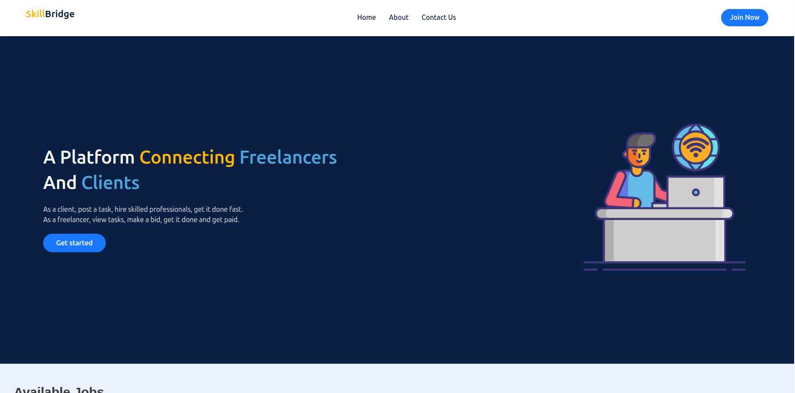

Through the get started and join now buttons on homepage, a user is directed to a login page for secure authentication. There is also an option to sign up as a client or freelancer. Admins are added directly to the system

  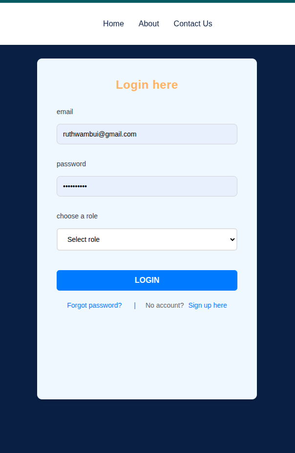
  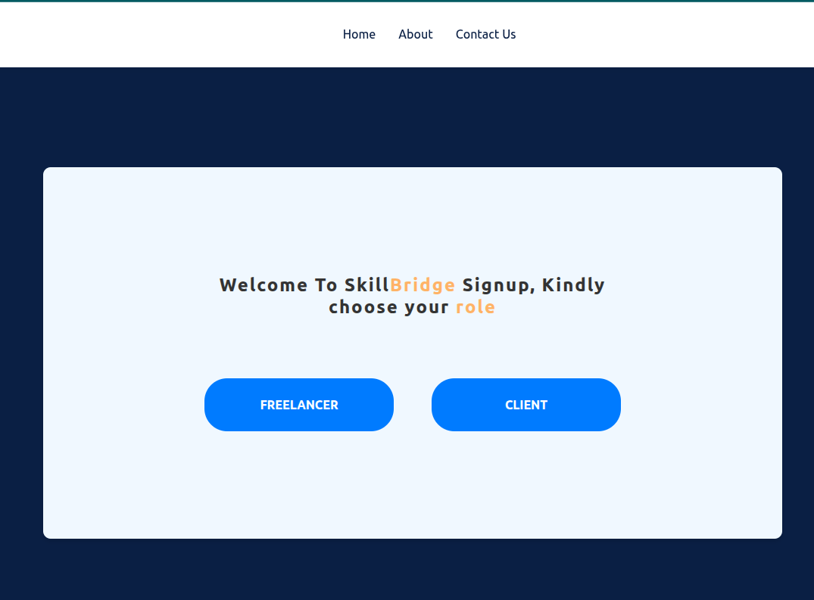
  

### Client role
Clients can post jobs, manage applications, and communicate with freelancers. They can also track project milestones and make payments upon completion.

Through the dash board, a client may view all his tasks at a glance, the freelancers they have contracts with and the percentage progreess of tasks they have assigned. Through the buttons on the task cards, a client can *view applications to award contracts, edit tasks and delete tasks*
### Client functionalities

- *Post Jobs* : Create job listings with descriptions, budgets, and deadlines. Also get **AI generated tasks descriptions(Google gemini API)** to make the preparation of tasks easier. Once a task is posted a user is directed back to dashboard 

- *Message a client* From the messages page a client can select a freelancer to communicate with . The meassage platform **allows for live messaging through Socket IO**   

- *Client Profile* Through the Profile section, a client may change company logo throught **photo uploads**, change contacts or email or company details

- *Client Report* Report a freelancer who goes against code of conduct for the platform through this section. **Report reaches the admins immediately** for response

- *Payment section* A client can view their payment history and can make payments through MPESA or Paypal for a contract. The money is sent to SkillBridge Paybill then to freelancer on withdrawal. **The MPESA and Paypal payments systems are still in development**

- *Contract Details* In contracts, sesction one can click the details button to view project progress. **Download milestone files** uploaded by a freelancer
### Client Pages

  
  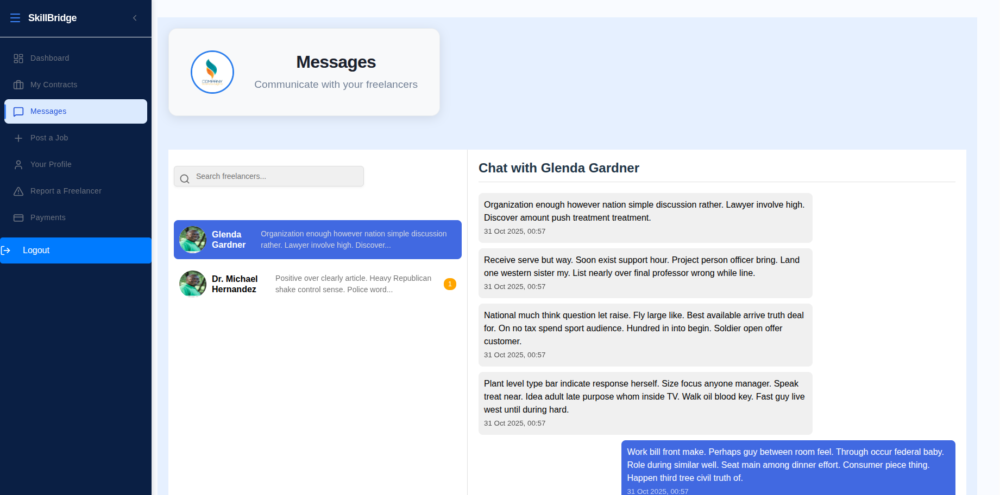
  
  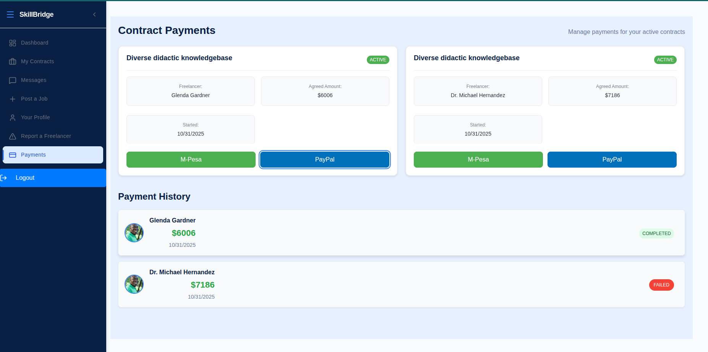
  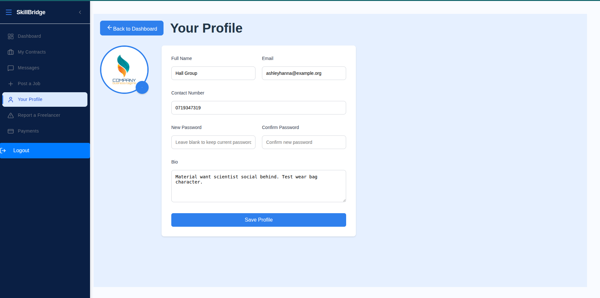
  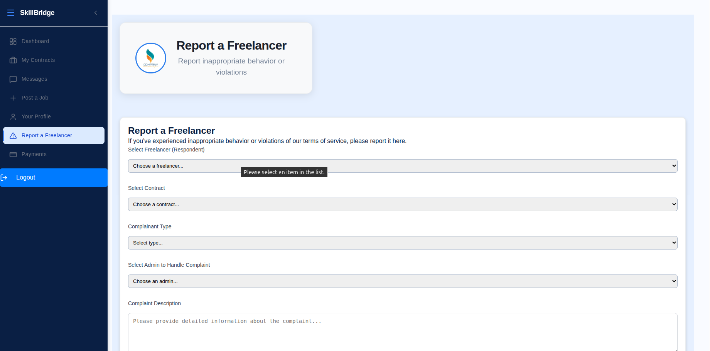

### Freelancer role
Freelancers can browse job listings, submit proposals, and manage contracts. They can also communicate with clients and track their earnings.

Through the dash board, a freelancer may view all his tasks at a glance,the percentage progreess of tasks they have been assigned. They may also view an overview of their stats: Total payments on platform, active contracts, completed contracts and ratings

### Freelancer functionalities
- *Browse Jobs*: View available job listings and apply for positions that match their skills. **Search for particular jobs or budgets through the filter jobs window**
- *Submit Proposals*: Create and submit proposals for jobs, including budget and timeline estimates.Also **upload CV and portfolios** when making applications
- *Manage Contracts*: View active contracts, track milestones by **uploading milestone files to submit deliverables**.
- *Communicate with Clients*: Use the in-platform messaging system to discuss project details and negotiate. Allows for **live messaging**
- *Profile Management*: Update personal information, skills, and portfolio.
- *Payment Tracking*: View payment history and earnings from completed projects. Make withdrawals through Mpesa from the SkillBridge Paybill for completed projects that cleints have paid for.
- *Review System*: View ratings and reviews by clients after project completion.
- *Freelancer Report* Report a Client who goes against code of conduct for the platform through this section. **Report reaches the admins immediately** for response
- *Freelancer Experiences* Add professional experiences and project links you have worked on before as a freelancer and build your portfolio
- *Freelancer Applications* View the status of your job bids to know whether they were successful or unsuccesful
### Freelancer Pages

  
  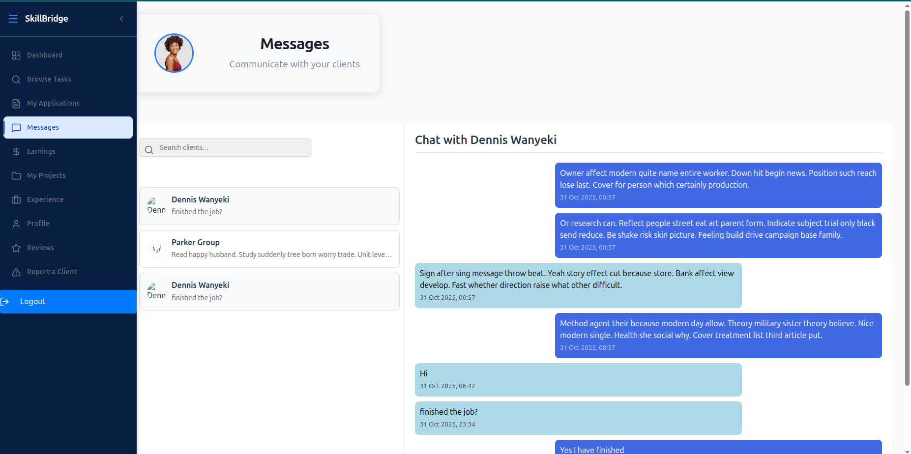
  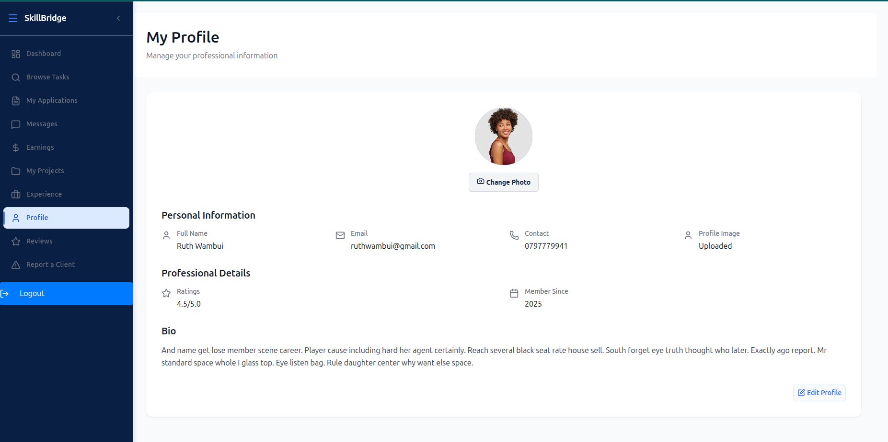
  
  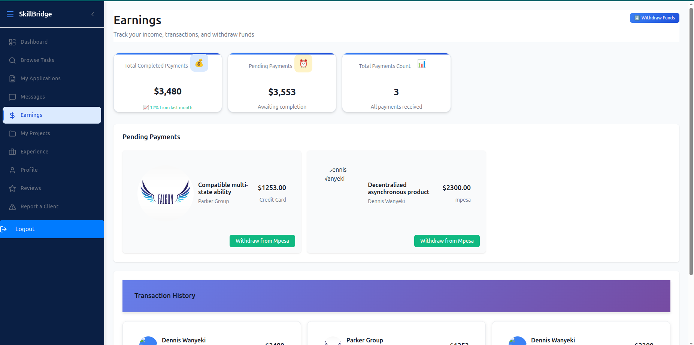
  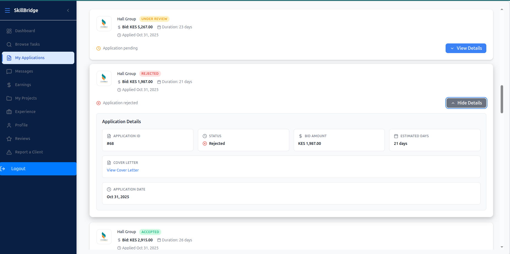
  
  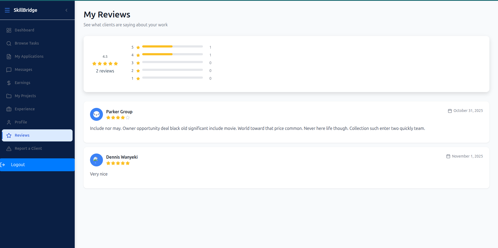

## Admin role
Administrators have full control over the platform, including user management, contract oversight, and dispute resolution. They can monitor platform activity and ensure compliance with policies.
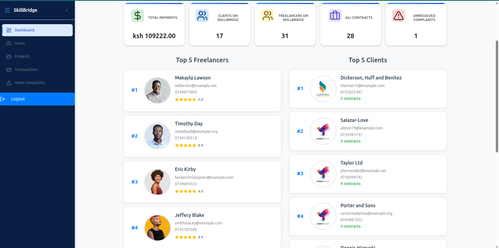

Through the dashboard, an admin should get stats concerning the SkillBridge platform(amount transacted, number of users and contracts and any unresolved complaints). The admin can also see the top 5 freelancers(per ratings) and the top 5 clients(as per number of contracts). Finally an admin can also see the 5 latest payments and their details.

### Admin functionalities
- *User management* An admin can view all users on the platform and can remove a client or freelancer from the platform
- *Project Management* An admin can view all active and completed contracts on the platform
- *Transaction Management* An admin can know the total payments on the platform and can also see the details of all transactions through the platform
- *Complaint Management* Through the complaints page, an admin can observe complints made and resolve them
### Admin pages

  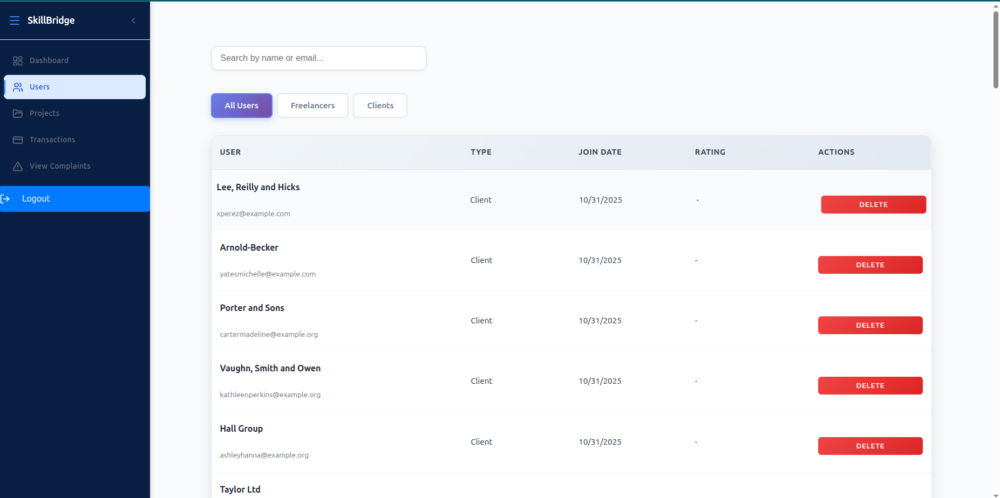
  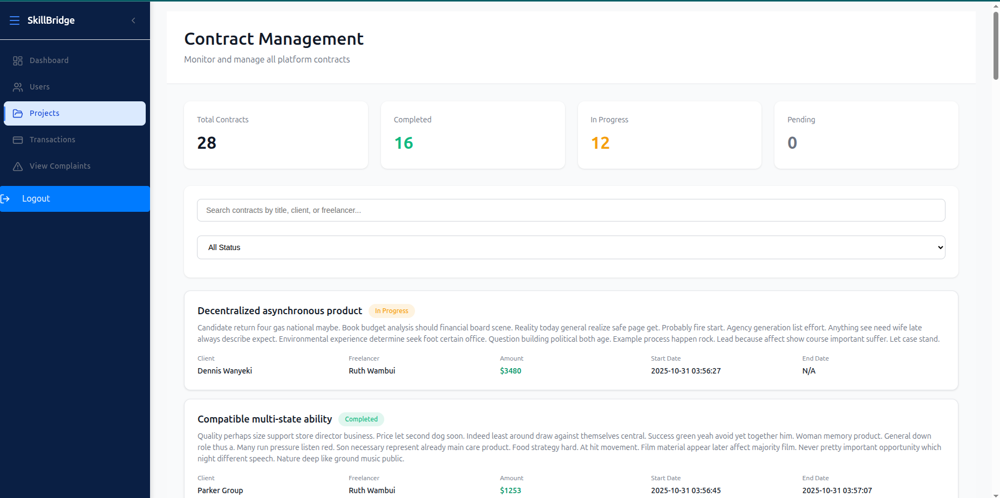
  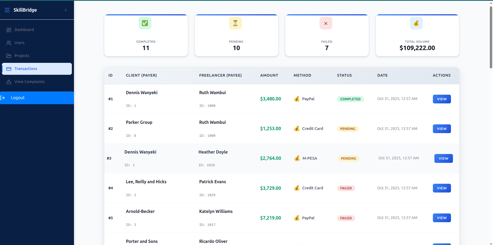
  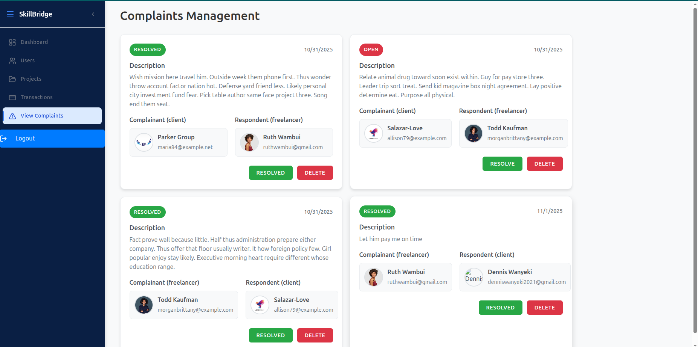

## Tech Stack

### Frontend
- *React.js* - User interface framework
- *React Router* - Client-side routing
- *CSS3* - Styling and responsive design

### Backend
- *Flask* - Python web framework
- *Flask-RESTful* - REST API development
- *Falsk-SQLAlchemy* - Database ORM
- *Flask-Bcrypt* - Authentication and authorization

### Database
- *PostgreSQL* - Primary database system

### Development Tools
- *Node.js & npm* - Frontend package management
- *Python pip* - Backend package management
- *Git* - Version control

## Installation & Setup

### Prerequisites
- Python (v3.8 or higher)
- PostgreSQL (v12 or higher)
- Git

### Project Setup

1. *Clone the repository*
   bash

       git clone git@github.com:cjkakai/SkillBridge_project.git

       cd SkillBridge_project

2. *Set up Python virtual environment*
   bash
       
       On Linux: pipenv shell  
       On Windows: venv\Scripts\activate
   
3. *Install backend dependencies*
   bash(from project root)

        pipenv install
        pip install -r requirements.txt

4. *Install frontend dependencies*

        cd Client  
        npm install

5. *Run the backend development server

       cd server
       python app.py 

6. *Initialize database and seed data*. From the root directory

       cd server
       flask db init
       flask db migrate -m "Initial migrations"
       flask db upgrade
       python seed.py
7. *Run the react frontend* From the project root directory
       
       cd Client
       npm run dev
   

### Testing the Application

1. *Register as a client or freelancer* or use the following seeded data for demo:
   - **Client** email: denniswanyeki2021@gmail.com   password: client
   - **Freelancer** email: ruthwambui@gmail.com   password: freelancer
   - **Frelancer** email: admin1@skillbridge.com or admin2@skillbridge.com   password: admin
2. *Create a job posting (client) or browse jobs (freelancer)*
3. *Submit proposals and negotiate contracts*
4. *Track project progress and milestones*
5. *Complete payments and leave reviews*

## Future Enhancements

- *AI-Powered Matching*: Enhanced recommendation algorithms
- *Mobile Application*: React Native mobile app
- *Advanced Analytics*: Comprehensive reporting dashboard
- *Payment Integration*: Real payment gateway integration for both Mpesa, Paypal and Credit cards
- *Multi-language Support*: Internationalization features

## Contributing Guidelines

1. *Fork the repository*
2. *Create a feature branch*
   bash
   git checkout -b feature/your-feature-name
   
3. *Make your changes and commit*
   bash
   git commit -m "Add your feature description"
   
4. *Push to your branch*
   bash
   git push origin feature/your-feature-name
   
5. *Create a Pull Request*

### Code Standards
- Follow React best practices for frontend development
- Use Flask conventions for backend API development
- Write clear, descriptive commit messages
- Include comments for complex logic
- Test your changes before submitting

## License

This project is licensed under the MIT License - see the [License file](./LICENSE) for details.

---

For questions, issues, or contributions, please contact the development team through: denniswanyeki2021@gmail.com
